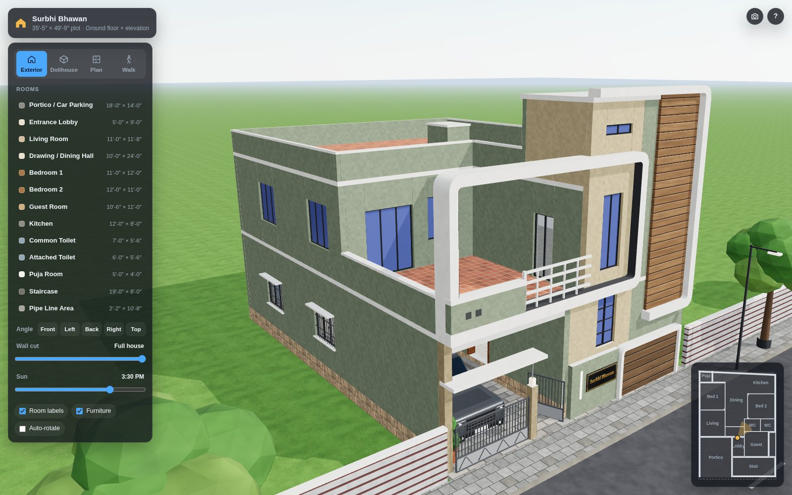
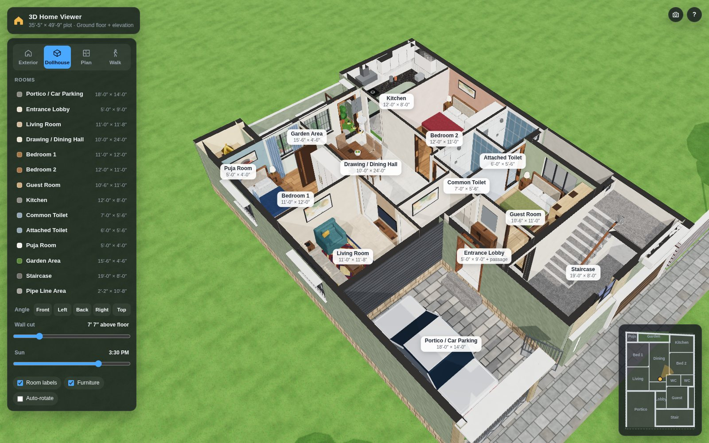
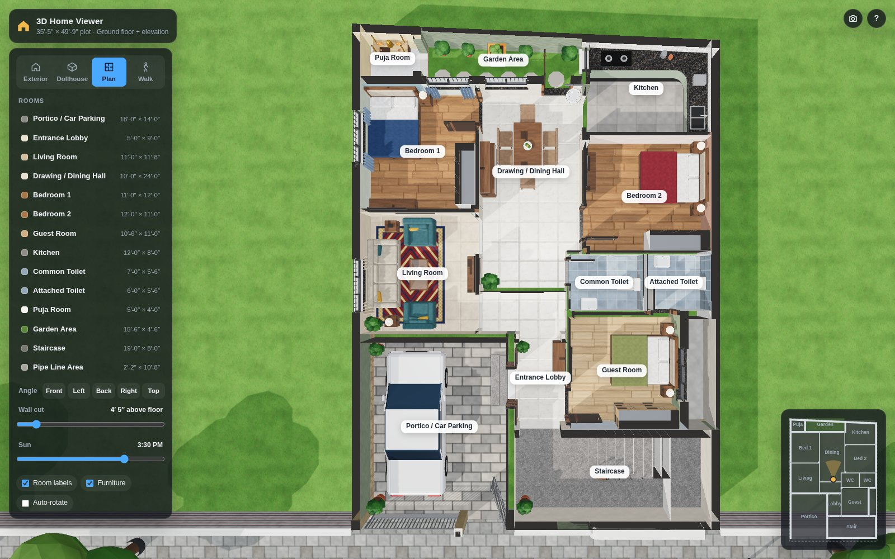
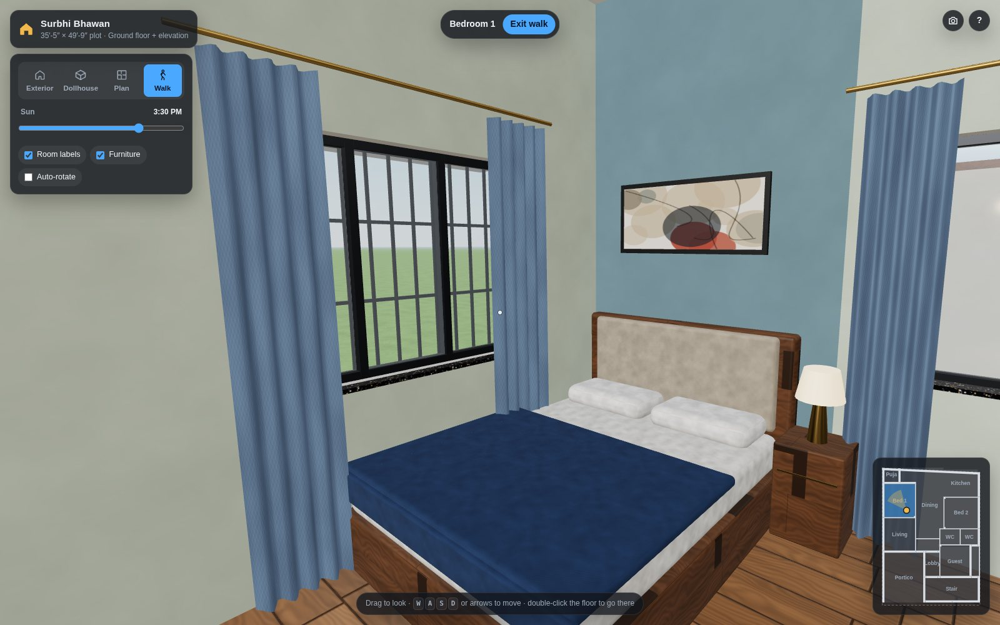
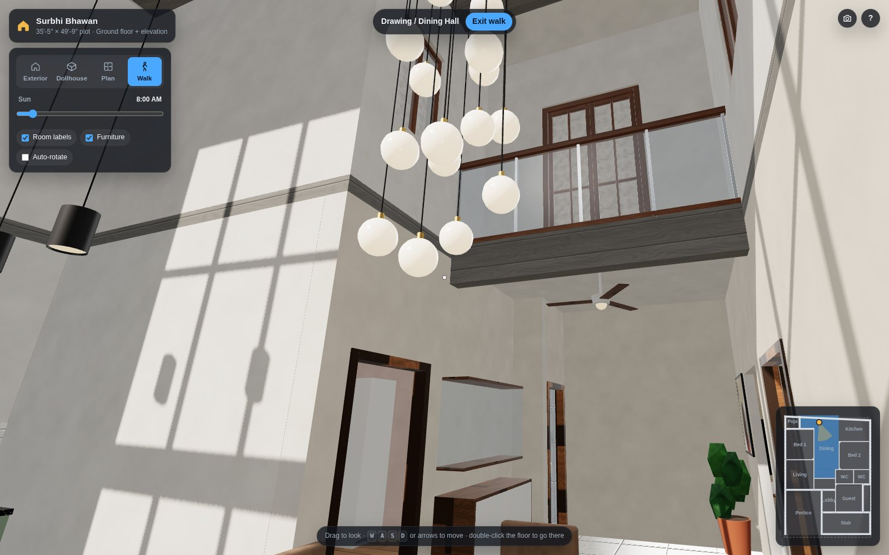

# Surbhi Bhawan — 3D home viewer

An interactive, textured 3D model of Surbhi Bhawan, a 35′-5″ × 49′-9″ house, built from the
supplied ground-floor plan and dressed with the front elevation's facade. Made with
**three.js** (WebGL) and plain HTML/CSS/JavaScript.

**Live site:** https://pspk001.github.io/home/



| Dollhouse cut-away | Plan view | Walk-through |
|---|---|---|
|  |  |  |


*The dining hall, kitchen and old garden share one double-height space with a first-floor balcony. Along the back the wall is solid up to door height, with a tall glass wall above it facing the sunrise.*

---

## Open it (no install)

Double-click **`Home-3D-Viewer.html`**. It is one self-contained file (~740 KB) with all code,
styles and textures inside, so it works offline in any recent Chrome, Edge, Safari or Firefox
(WebGL 2 required). It also works on phones and tablets.

## What you can do

| Control | What it does |
|---|---|
| **Exterior** | Orbit around the house: drag to rotate, scroll / pinch to zoom, right-drag / two fingers to pan |
| **Dollhouse** | Walls sliced at 7′-7″ so every room is visible from above, from any angle |
| **Plan** | Top-down view that matches the drawing, with furniture |
| **Walk** | First-person tour: drag to look, <kbd>W</kbd><kbd>A</kbd><kbd>S</kbd><kbd>D</kbd> / arrows to move (<kbd>Shift</kbd> to run), double-click the floor to walk there, climb the stairs. On phones use the on-screen joystick |
| **Rooms list / labels / minimap** | Click any room to fly into it. The info card shows size, area, floor finish and a **Walk inside** button |
| **Angle** | One-click Front / Left / Back / Right / Top views |
| **Wall cut** | Slice the whole house at any height (from 1 ft above the floor up to the full house) |
| **Sun** | Move the sun from 7 AM to 6:30 PM (shadows update). As on site, it rises behind the house and sets over the road |
| **Room labels / Furniture / Auto-rotate** | Toggles |
| 📷 | Save the current view as a PNG |

Keyboard: <kbd>1</kbd>–<kbd>4</kbd> views · <kbd>L</kbd> labels · <kbd>F</kbd> furniture · <kbd>R</kbd> auto-rotate · <kbd>Esc</kbd> back.

## Tech stack

| Layer | Used |
|---|---|
| Markup / styling | HTML5, CSS3 (custom properties, backdrop blur, responsive bottom sheet for phones) |
| Language | JavaScript (ES modules) |
| 3D engine | [three.js](https://threejs.org) r186: WebGL 2 renderer, PBR materials, soft shadows, OrbitControls, CSS2DRenderer (labels), Sky, RoomEnvironment, RoundedBoxGeometry, BufferGeometryUtils |
| Tooling | [Vite](https://vite.dev) 8 (dev server + bundler) and `vite-plugin-singlefile` (builds the offline single HTML file) |
| Textures | Generated in code on `<canvas>`: vitrified and marble tiles, oak flooring, granite, subway and bathroom tiles, wood cladding, siding, pavers, plinth stone, grass, fabric, rug, asphalt. There are no image files |

## Edit and rebuild

Needs [Node.js](https://nodejs.org) 18 or newer.

```bash
npm install
npm run dev      # live dev server (opens http://localhost:5173)
npm run build    # writes dist/index.html and refreshes Home-3D-Viewer.html
npm run preview  # serve the production build
```

### Deployment (GitHub Pages)

`.github/workflows/deploy.yml` runs on every push to `main`: it installs the packages, runs
`npm run build` and publishes `dist/` to GitHub Pages (**Settings → Pages → Source: GitHub Actions**).
Edit the code, push, and the live site updates in about a minute.

### Where things live

```
home/
├─ Home-3D-Viewer.html   standalone build: double-click to open
├─ index.html            page + UI markup (Vite entry)
├─ package.json          dependencies and scripts
├─ vite.config.js        single-file build setup
├─ .github/workflows/    GitHub Pages build + deploy
├─ docs/                 preview screenshots
└─ src/
   ├─ main.js            start-up and loading screen
   ├─ config.js          levels (plinth, ceiling, slab), door/window heights, plot, stair, colours
   ├─ plan.js            every wall, opening, door and room, measured from the floor plan (in feet)
   ├─ textures.js        procedural canvas textures
   ├─ materials.js       material library + the "wall cut" section shader
   ├─ geometry.js        batching, world-scale UVs, extrusion and mesh-merging helpers
   ├─ style.css          UI styles (desktop side panel, phone bottom sheet)
   ├─ build/
   │  ├─ structure.js    walls, floors, ceiling slab, staircase, bathroom tiles, kitchen dado
   │  ├─ openings.js     windows (frames, glass, grilles, sills, chajjas) and doors
   │  ├─ exterior.js     first-floor shell, roof, rear glass wall, mumty, C-frame, cladding, gates, street
   │  └─ furniture.js    beds, wardrobes, sofas, dining, kitchen, toilets, mandir, SUV, fans…
   └─ viewer/
      ├─ viewer.js       renderer, lights, sky, view modes, room focus, picking
      ├─ walk.js         first-person walking (collisions, stairs, joystick)
      ├─ tween.js        camera animation helper
      └─ ui.js           panel, room list, minimap, info card, shortcuts
```

### Common tweaks

- **Wall paint:** `src/materials.js`, e.g. `paint('pBed1', 0xd3ddcb)`; feature walls are `accentBed1`, `accentBed2`, `accentGuest`, `accentLiving`.
- **Floor finish of a room:** `floor:` in `ROOMS` (`src/plan.js`). Options: `tileMarble`, `tileWarm`, `wood`, `woodLight`, `tileKitchen`, `tileBath`, `marble`, `graniteGrey`, `pavers`.
- **Heights (plinth, ceiling, doors, windows):** `LV` and `OPENING` in `src/config.js`.
- **Move or add furniture:** `buildFurniture()` in `src/build/furniture.js` (positions are in feet).

## How the model was made

- **Walls, columns, doors and windows:** measured from the supplied floor plan (22.73 px = 1 ft) and converted to feet. The origin is the front-left corner of the building, and the rear boundary is slanted exactly as drawn (48′-9″ left, 47′-2″ right).
- **Furniture:** placed where the furnished plan shows it.
- **Assumed heights:** 2′ plinth, 11′ clear ground-floor height, 6″ slabs, 7′ door heads, window sills 3′ above the floor.
- **Facade:** colours and features come from the elevation image: sage walls, tan stair tower with tall windows, the white "C" frame around the first-floor terrace, the wood-cladding panel and its frame, the slatted box at the base, the gates, the portico canopy, the parapet with vents and the white railing.
- **Open double-height space (design change):** the walls between the drawing/dining hall, the kitchen and the old garden are gone, so the three share one space. The garden is paved in with the hall, and the puja room now opens onto it. There is no first-floor slab over this space: it rises about 22 ft to a solid roof with a board-formed concrete soffit. The double height also covers the middle of the hall, where a first-floor balcony with a glass railing looks down into the space. Along the back, behind the old garden, the dining area and the kitchen, the rear (east) wall is solid up to door height (7 ft above the floor) and a teak-framed glass wall above it rises to the roof, so the morning sun comes in over the lower wall. A cascade of glass globes hangs over the dining table. The wash basin stands against the rear wall beside the kitchen counter. The config is `VOID` in `src/config.js`.
- **Bedroom doors (design change):** bedroom 1's door moved to the living-room end of its wall and bedroom 2's door to the kitchen end of its wall. Bedroom 1's wardrobe and bedroom 2's TV wall moved to suit, and the hall's crockery unit now stands where bedroom 2's old door was.
- **Living room:** a 9′-wide window onto the portico (no sunshade, since the portico is roofed).
- **Portico:** a full-size 7-seater SUV in graphite grey, parked nose-out. It is a generic model, not a specific make.
- **Name plate:** "Surbhi Bhawan" in raised brass letters on a black granite plate (4′-10″ × 2′-0″), beside the light slit at the front of the stair block. The app header uses the same name.

## Assumptions and limitations

- The first-floor layout was not provided, so the first floor is an **exterior shell** that matches the elevation (terrace over the portico, stair headroom/mumty, parapets). In walk mode the stairs stop at the first-floor landing. The first-floor windows and balcony that face the double-height space have sheer curtains, because the rooms behind them are not modelled.
- The dashed "X" in the entrance lobby is treated as the entrance lobby. It is not modelled as a double-height cut-out.
- The plan shows no door swings, so doors are shown open and the main door is pushed back against the lobby wall.
- The plan labels the hall 10′×24′. As drawn, a partition separates the passage, which left about 10′×20′ of dining/drawing space. With the old garden merged in, the hall now runs about 24′ from that partition to the rear wall.
- Added for context: the road, footpath, trees and neighbouring compound walls.
- Orientation: the back of the house faces east and the road faces west, so the sun rises behind the house and sets over the road.
